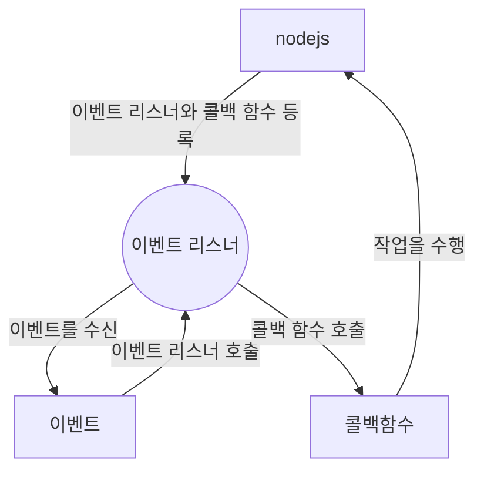

# NodeJs란

## nodejs란 서버인가?

- nodejs 자체는 웹서버가 아니고 nodejs는 js를 사용해서 서버 측의 코드를 작성하고 서버를 구축할 수 있게 도와주고 개발 생산성을 위해 npm을 통해 모듈을 제공
- nodejs가 개발된 이유는 웹 서버 개발을 하기 위해서도 있지만 방대한 오픈소스 생태계를 구축하기 위해서 개발(생산성 증가)

## npm(node package manager)

- 개발자들이 작성한 모듈을 공유할 수 있는 패키지 저장소
- npm을 사용하면 모듈을 쉽게 설치 받아서 사용 가능

## v8 javascript

- Chrome V8 javscript 엔진으로 'build' 된 서버 측 자바스크립트 런타임 환경. 브라우저와 런타임환경이 다름 ?
- build : 코드를 컴파일러를 통해 실행파일로 변환하는 작업
- build가 되었다는건 구글이 개발한 v8 javascript 엔진을 사용해서 build ?
- 구글에서 개발한 v8 javascript 엔진은 2008년도에 open source로 공개되고 구글에서 개발한 js엔진을 사용하고 `비동기 I/O` 와 `이벤트 기반의 아키텍처`를 채택해서 속도가 빠름

## nodejs의 블로킹과 논블로킹

- nodejs에서 `비동기 I/O` 작업을 진행하는 동안 또 다른 작업을 실행 가능
- I/O 작업이 완료될떄까지 기다리면서 다른 코드를 또 실행 가능
- Input/Output : 브라우저에서 파일을 조작 할 수 없음. 네트워크, 디스크 등 데이터를 읽거나 쓰거나 하는 작업
- 블로킹 : 작업이 끝날때까지 다른 작업을 수행하지 않음. 블로킹 I/O 작업을 수행하는 동안 다른 코드의 실행이 중단
- 논블로킹 : I/O 작업을 기다리는 동안 다른 코드 실행 가능. nodejs는 모든 I/O 작업은 비동기적으로 실행되고 블로킹을 하지 않음

## nodejs의 이벤트 기반의 아키텍처

- nodejs 가장 큰 특징은 이벤트 기반의 아키텍처
- 이벤트 기반 : 이벤트를 실행 시키면 이벤트로 등록한 작업을 수행하는 것. javascript에서 클릭 같은 이벤트에 콜백함수를 작성해놓고 이벤트 기반의 특정 이벤트가 발생하면 등록시킨 콜백함수를 호출해서 실행. 이런 내용을 `이벤트 리스너에 콜백함수를 등록`
- 이벤트 기반의 프로그래밍은 이벤트가 발생하면 콜백 함수를 실행시키는 방식
- 이벤트 기반의 프로그래밍을 작성하면 비동기식 처리가 가능하고 좋은 성능과 확장성을 가짐
- nodejs는 이벤트가 발생하면 이벤트에 등록된 콜백 함수를 호출하고 이벤트를 다 처리하면 다음 이벤트 발생까지 대기

